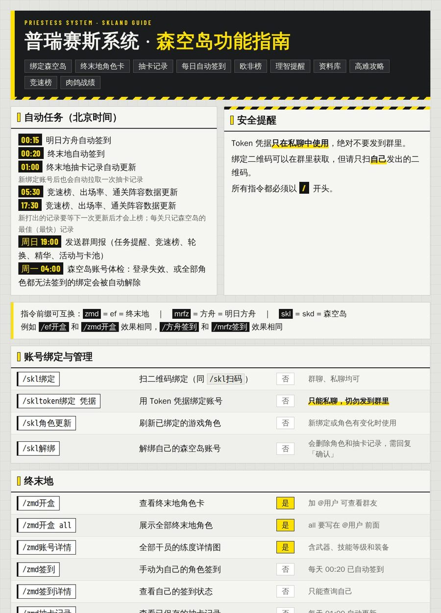
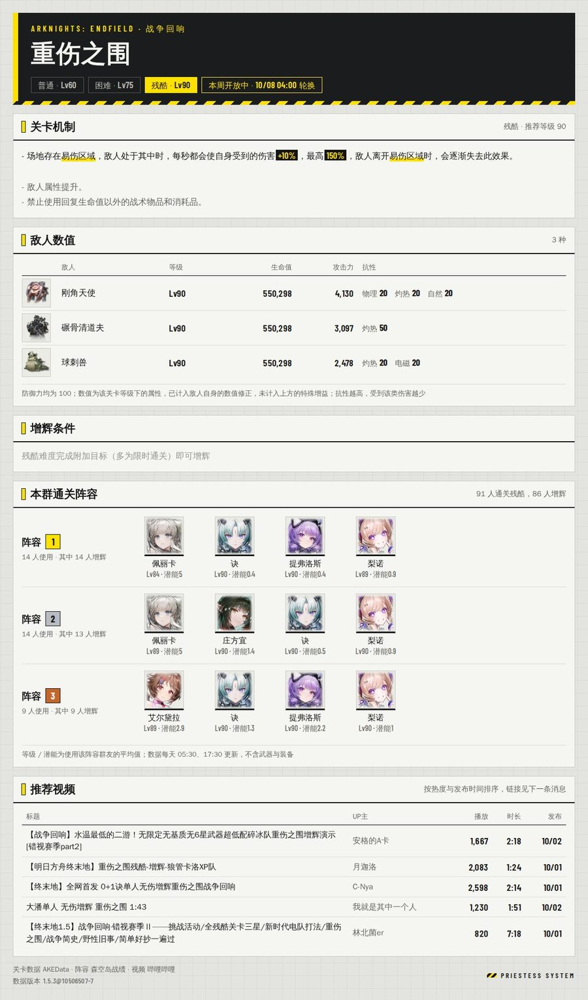
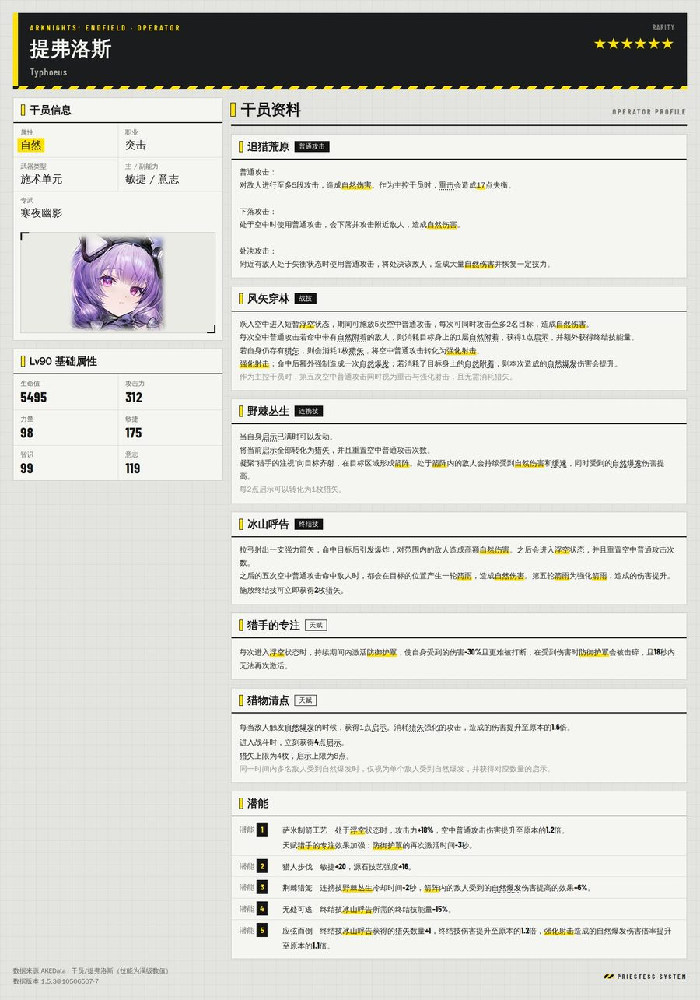

# Priestess Bot

面向《明日方舟：终末地》与《明日方舟》玩家群的 QQ 群机器人，基于 NoneBot2 与 NapCat。
A QQ group bot for Arknights: Endfield / Arknights communities, built on NoneBot2 and NapCat.


本项目是一套可直接部署的机器人工程：`bot.py` 加上 `plugins/` 下的本地插件。森空岛绑定、签到、
角色卡等基础能力来自上游插件 [nonebot-plugin-skland](https://github.com/FrostN0v0/nonebot-plugin-skland)，
本仓库在其之上增加了终末地资料库、高难关卡攻略与榜单、群周报、账号体检和统一的终末地风格出图，
并包含若干针对慢速网络环境的稳定性补丁。上游安装包本身不做任何修改。

## 目录

- [功能](#功能)
- [截图](#截图)
- [运行环境](#运行环境)
- [架构](#架构)
- [部署](#部署)
- [配置](#配置)
- [指令](#指令)
- [定时任务](#定时任务)
- [目录结构](#目录结构)
- [数据与隐私](#数据与隐私)
- [常见问题](#常见问题)
- [致谢](#致谢)
- [免责声明](#免责声明)
- [许可证](#许可证)

## 功能

- 森空岛账号绑定（扫码或 Token），明日方舟与终末地每日自动签到，签到遇到网络超时自动重试
- 终末地角色卡（开盒）、全干员练度详情、抽卡记录与每日自动同步、群内欧非榜
- 终末地资料库：干员与武器资料卡，支持昵称、简称、同音字和模糊匹配；数据来自 AKEData，
  解包数据有新版本时自动重建索引并在群内通知
- 高难关卡（战争回响、影拓丰碑）：关卡攻略卡（机制、敌人数值与抗性、通关阵容、B 站推荐视频）、
  群内竞速榜、全体绑定玩家的干员出场率
- 理智查询，理智回满时在群内提醒
- 群周报（每周日 19:00）：每周任务、本群竞速前三、关卡轮换、本周群精华、活动与卡池倒计时；
  机器人是管理员的群会附带 @全体成员
- 森空岛账号体检（每周一 04:00）：自动清理登录失效、或全部角色都无法使用的绑定，删除前自动备份
- 所有图片统一为终末地风格的版式，并针对 QQ 上传速度做了体积控制
- 指令严格匹配：指令后必须是空格或结尾，避免聊天内容误触发

## 截图

| 帮助 | 关卡攻略 | 干员资料 |
|---|---|---|
|  |  |  |

## 运行环境

| 项目 | 已验证的环境 | 说明 |
|---|---|---|
| 操作系统 | Ubuntu 24.04 LTS | 其他带 systemd 的 Linux 发行版应可使用 |
| CPU 架构 | aarch64（ARM64） | 在 Oracle Cloud Ampere A1（2 核 / 12 GB）上长期运行；x86_64 理论可用，未实测，需把 compose 文件中的 `platform` 改为 `linux/amd64` |
| Python | 3.12 | 只在 3.12 上验证过，建议使用同一版本 |
| Docker | 29.x | 仅用于运行 NapCat |
| 内存 | 建议 2 GB 以上 | 出图使用无头 Chromium |
| 中文字体 | 文泉驿正黑（`fonts-wqy-zenhei`） | 图片中的中文字体；数字与英文使用仓库内置的 Barlow Condensed |
| 网络 | 可访问 QQ、森空岛、AKEData、哔哩哔哩、GitHub | 部分资源从 GitHub 下载 |

Windows 与 macOS 未测试：systemd 单元、字体安装方式和部分路径假设都以 Linux 为准。

## 架构

```
QQ  <-->  NapCat (Docker, OneBot v11)  <-- 反向 WebSocket -->  NoneBot2 (bot.py, systemd)
                                                                   |
                                                                   +-- 上游插件: nonebot-plugin-skland, nonebot-plugin-pErithacus ...
                                                                   +-- 本地插件: plugins/
                                                                   +-- SQLite (data/)，无头 Chromium 出图
```

NapCat 负责登录 QQ 并提供 OneBot v11 接口；NoneBot2 作为 WebSocket 服务端监听 `127.0.0.1:8080`，
NapCat 以反向 WebSocket 客户端连入。动态推送可另外搭配
[nonebot-bison](https://github.com/MountainDash/nonebot-bison)，本仓库不包含它。

## 部署

以下以 Ubuntu 24.04 为例，假设安装在 `/opt/priestess-bot`。

1. 安装系统依赖

   ```bash
   sudo apt update
   sudo apt install -y python3.12-venv fonts-wqy-zenhei git
   # Docker 请按官方文档安装: https://docs.docker.com/engine/install/ubuntu/
   ```

2. 获取代码并安装 Python 依赖

   ```bash
   git clone https://github.com/HelinWang0721/Priestess-bot.git /opt/priestess-bot
   cd /opt/priestess-bot
   python3.12 -m venv .venv
   .venv/bin/pip install -r requirements.txt
   ```

3. 写配置

   ```bash
   cp .env.example .env
   chmod 600 .env
   # 编辑 .env: 设置 ONEBOT_ACCESS_TOKEN 和 SUPERUSERS
   ```

4. 启动 NapCat 并登录 QQ

   ```bash
   cp compose.example.yaml compose.yaml
   # 按文件内注释修改 platform、NAPCAT_UID/GID 和路径
   mkdir -p data/nonebot_plugin_perithacus/media
   docker compose up -d
   ```

   在 NapCat WebUI（默认只监听本机 `127.0.0.1:6099`，可通过 SSH 隧道访问）中扫码登录，然后在
   「网络配置」里新增一个 **WebSocket 客户端**：地址 `ws://127.0.0.1:8080/onebot/v11/ws`，
   Token 填 `.env` 里的 `ONEBOT_ACCESS_TOKEN`，消息格式选 `array`。

5. 初始化数据库并首次启动

   ```bash
   .venv/bin/python deploy/orm_cli.py upgrade
   .venv/bin/python bot.py
   ```

   首次启动会下载无头 Chromium、森空岛资源和 AKEData 数据表，需要几分钟。看到
   `Bot ... connected` 即表示已与 NapCat 连通，在群里发 `/skl帮助` 测试。

6. 注册为系统服务

   ```bash
   # 按文件内注释修改路径和用户
   sudo cp deploy/nonebot.service.example /etc/systemd/system/nonebot.service
   sudo systemctl daemon-reload
   sudo systemctl enable --now nonebot
   ```

修改 `plugins/skl_help/help.html` 后，运行 `.venv/bin/python deploy/render_skl_help.py` 重新生成帮助图，
无需重启。

## 配置

`.env` 中的主要配置项：

| 配置项 | 示例 | 说明 |
|---|---|---|
| `HOST` / `PORT` | `127.0.0.1` / `8080` | NoneBot 监听地址，供 NapCat 反向连接；不要暴露到公网 |
| `ONEBOT_ACCESS_TOKEN` | 随机长字符串 | 与 NapCat WebSocket 客户端的 Token 一致 |
| `SUPERUSERS` | `["123456789"]` | 可使用管理指令的 QQ 号 |
| `COMMAND_START` | `["/"]` | 指令前缀 |
| `API_TIMEOUT` | `180` | 等待 NapCat 响应的秒数；上传图片较慢时不要调小 |
| `LOCALSTORE_USE_CWD` | `true` | 插件数据放在工程目录下的 `data/`、`cache/`、`config/` |

定时任务使用 `nonebot-plugin-apscheduler` 的默认时区 Asia/Shanghai，与服务器系统时区无关。

## 指令

所有指令都以 `/` 开头。「可 @他人」表示可以在指令后 @ 群成员查看对方的数据。

### 账号

| 指令 | 作用 | 备注 |
|---|---|---|
| `/skl绑定` | 扫二维码绑定森空岛（同 `/skl扫码`） | 群聊、私聊均可 |
| `/skltoken绑定 凭据` | 用 Token 凭据绑定 | 只能私聊 |
| `/skl角色更新` | 刷新已绑定的游戏角色 | |
| `/skl解绑` | 解绑并删除角色与抽卡记录 | 需回复「确认」 |

### 终末地

| 指令 | 作用 | 可 @他人 |
|---|---|---|
| `/zmd开盒`、`/zmd开盒 all` | 终末地角色卡 / 展示全部角色 | 是 |
| `/zmd账号详情`（别名 `/账号详情`） | 全部干员的练度详情图：武器、技能等级、装备 | 是 |
| `/zmd签到`、`/zmd签到详情` | 手动签到 / 查看签到状态 | 否 |
| `/zmd抽卡记录`、`/zmd抽卡记录更新` | 查看 / 立即拉取抽卡记录 | 否 |
| `/zmd欧非榜`（别名 `/欧非榜`） | 本群限定池欧非排行；`/zmd欧非榜 退出` 可不上榜 | 仅群聊 |

### 终末地资料库

| 指令 | 作用 |
|---|---|
| `/干员名` | 干员资料卡，支持昵称与同音字，例如 `/提丰`、`/小庄` |
| `/干员名专武` | 该干员专属武器的资料卡 |
| `/武器名` | 武器资料卡，支持简称 |

### 高难关卡

| 指令 | 作用 |
|---|---|
| `/战争回响` | 本期轮换的关卡与剩余时间 |
| `/影拓丰碑` | 全部系列与关卡名 |
| `/攻略 关卡名 [难度]` | 机制、敌人数值、通关阵容、推荐视频 |
| `/竞速榜` | 竞速榜目录 |
| `/回响竞速 [关卡名]` | 战争回响群内最快通关排名 |
| `/丰碑竞速 [丰碑名或关卡名]` | 影拓丰碑群内最快通关排名 |
| `/榜单角色出场率 [范围]` | 全部绑定玩家的高难干员出场率 |
| `/攻略统计 退出` / `加入` | 退出或重新加入阵容统计与榜单 |

### 明日方舟与其他

| 指令 | 作用 |
|---|---|
| `/mrfz卡片`、`/mrfz签到`、`/mrfz签到详情`、`/mrfz抽卡记录` | 明日方舟角色卡、签到与抽卡记录 |
| `/方舟干员 [筛选词]` | 干员一览 |
| `/树海肉鸽` 等 | 集成战略战绩 |
| `/理智` | 查看方舟与终末地当前理智 |
| `/理智提醒 开` / `关` | 理智回满时在本群提醒 |
| `/skl帮助` | 帮助图 |

### 管理指令（仅 SUPERUSERS）

| 指令 | 作用 |
|---|---|
| `/周报预览` | 在当前聊天生成周报，不会 @全体成员 |
| `/森空岛体检` | 检查全部绑定，只报告不改动 |
| `/森空岛体检 清理` | 检查并解除失效绑定 |
| `/攻略数据更新` | 立即收集高难关卡战绩 |

## 定时任务

时间均为北京时间。

| 时间 | 任务 | 来源 |
|---|---|---|
| 每天 00:15 / 00:20 | 明日方舟 / 终末地自动签到 | nonebot-plugin-skland |
| 每天 01:00 | 终末地抽卡记录自动同步 | `skland_auto_gacha` |
| 每天 05:30、17:30 | 收集高难关卡战绩（竞速榜、出场率、通关阵容） | `endfield_guide` |
| 每天 06:00 | 检查机器人在哪些群是管理员 | `weekly_report` |
| 每 10 分钟 | 理智回满检查 | `sanity_reminder` |
| 定期 | 检查 AKEData 数据版本 | `endfield_wiki` |
| 每周日 19:00 | 向所有群发送周报 | `weekly_report` |
| 每周一 04:00 | 森空岛账号体检 | `skland_health` |

## 目录结构

```
bot.py                         入口，按顺序加载插件
requirements.txt               固定版本的依赖
compose.example.yaml           NapCat 的 Docker Compose 示例
.env.example                   配置示例
deploy/
  nonebot.service.example      systemd 单元示例
  render_skl_help.py           生成帮助图
  orm_cli.py                   数据库迁移命令行
plugins/
  ef_theme/                    共享的终末地风格样式与字体
  endfield_wiki/               终末地资料库（AKEData 同步、检索、资料卡）
  endfield_guide/              高难关卡攻略、竞速榜、出场率
  endfield_roster/             账号详情
  skland_gacha_rank/           欧非榜
  weekly_report/               群周报
  skland_health/               账号体检与签到网络重试
  sanity_reminder/             理智查询与提醒
  skl_help/                    帮助图
  skland_ef_theme/             开盒与抽卡记录的终末地风格模板
  skland_compact_images/       开盒与抽卡记录的图片体积控制
  skland_auto_gacha/           抽卡记录每日自动同步
  skland_shortcuts/            指令别名
  skland_efgacha_compat/       上游武器池数据兼容
  skland_resource_resilience/  上游资源下载的超时与重试
  perithacus_guard/            pErithacus 管理指令权限保护
  perithacus_trigger_resilience/  pErithacus 关键词触发的下载超时保护
  strict_command.py            指令严格匹配规则
```

若干本地插件通过包装上游函数工作，并在启动时校验上游文件的 SHA-256。升级上游插件后如果校验不通过，
对应插件会拒绝启动或自动退回上游原始行为，需要重新核对后更新代码中的校验值。

## 数据与隐私

- `data/` 中的数据库保存了用户的森空岛凭证，`.env` 和 `napcat/` 中有访问令牌和 QQ 登录态。
  这些目录已在 `.gitignore` 中排除，请勿提交或公开，并保持目录权限为仅本人可读。
- 账号体检在删除任何绑定前，会把被删除的数据导出到 `backups/skland-health/`。
- 竞速榜和出场率只使用已绑定用户的最佳通关记录；用户可用 `/攻略统计 退出`、`/zmd欧非榜 退出` 退出统计。
- 机器人日志中会出现 QQ 号和群号，分享日志前请自行脱敏。

## 常见问题

**图片发送很慢或超时。** 从海外服务器向 QQ 上传图片可能只有每秒十几到二十几 KB。本项目已对大图做了缩放与
压缩，并把 `API_TIMEOUT` 调到 180 秒；NapCat 的上传超时也建议相应调大。

**升级 nonebot-plugin-skland 后启动失败。** 见上文关于 SHA-256 校验的说明，这是有意的保护，
避免本地补丁在上游代码变化后静默失效。

**图片里的中文显示为方块。** 安装 `fonts-wqy-zenhei` 后重启。

**活动、卡池或下期轮换没有显示。** 这些来自 AKEData 的游戏解包数据，版本更新后可能有延迟，
以游戏内公告为准。

## 致谢

本项目建立在以下开源项目与数据源之上，感谢各位作者的工作。

| 项目 | 用途 | 许可证 |
|---|---|---|
| [nonebot/nonebot2](https://github.com/nonebot/nonebot2) | 机器人框架 | MIT |
| [nonebot/adapter-onebot](https://github.com/nonebot/adapter-onebot) | OneBot v11 适配器 | MIT |
| [NapNeko/NapCatQQ](https://github.com/NapNeko/NapCatQQ)、[NapNeko/NapCat-Docker](https://github.com/NapNeko/NapCat-Docker) | QQ 协议端及其 Docker 镜像 | 见各仓库 |
| [FrostN0v0/nonebot-plugin-skland](https://github.com/FrostN0v0/nonebot-plugin-skland) | 森空岛绑定、签到、角色卡、抽卡记录等核心能力；`plugins/skland_ef_theme/templates/` 中的模板改写自该项目 | MIT |
| [FrostN0v0/EndfieldGachaPoolTable](https://github.com/FrostN0v0/EndfieldGachaPoolTable) | 终末地卡池数据 | 见仓库 |
| [SnowMoonSS/nonebot-plugin-pErithacus](https://github.com/SnowMoonSS/nonebot-plugin-pErithacus) | 关键词词库与回复 | MIT |
| [kexue-z/nonebot-plugin-htmlrender](https://github.com/kexue-z/nonebot-plugin-htmlrender) | HTML 渲染出图 | MIT |
| [nonebot/plugin-alconna](https://github.com/nonebot/plugin-alconna) | 指令解析与跨平台消息 | MIT |
| [nonebot/plugin-orm](https://github.com/nonebot/plugin-orm) | 数据库 ORM | MIT |
| [nonebot/plugin-apscheduler](https://github.com/nonebot/plugin-apscheduler) | 定时任务 | MIT |
| [nonebot/plugin-localstore](https://github.com/nonebot/plugin-localstore) | 本地数据目录 | MIT |
| [he0119/nonebot-plugin-user](https://github.com/he0119/nonebot-plugin-user) | 用户与平台账号绑定 | MIT |
| [KomoriDev/nonebot-plugin-argot](https://github.com/KomoriDev/nonebot-plugin-argot) | 上游插件依赖 | MIT |
| [MountainDash/nonebot-bison](https://github.com/MountainDash/nonebot-bison) | 可选搭配的动态订阅推送（不包含在本仓库中） | MIT |
| [microsoft/playwright-python](https://github.com/microsoft/playwright-python) | 无头浏览器 | Apache-2.0 |
| [encode/httpx](https://github.com/encode/httpx) | HTTP 客户端 | BSD-3-Clause |
| [python-pillow/Pillow](https://github.com/python-pillow/Pillow) | 图片处理 | MIT-CMU |
| [mozillazg/python-pinyin](https://github.com/mozillazg/python-pinyin) | 同音字检索 | MIT |
| [sqlalchemy/sqlalchemy](https://github.com/sqlalchemy/sqlalchemy) | 数据库访问 | MIT |
| [jpt/barlow](https://github.com/jpt/barlow) | Barlow Condensed 字体（`plugins/ef_theme/fonts/`） | SIL OFL 1.1 |
| [AKEData](https://www.akedata.wiki/) | 终末地解包数据：干员、武器、关卡、敌人、活动与卡池时间 | 见站点说明 |

第三方代码与字体的版权声明见 [THIRD_PARTY_NOTICES.md](THIRD_PARTY_NOTICES.md)。

## 免责声明

本项目为玩家社区的非官方工具，与鹰角网络（Hypergryph）、GRYPHLINE、森空岛及腾讯 QQ 没有任何关联。
《明日方舟》《明日方舟：终末地》的名称、美术素材与游戏数据的著作权归其权利人所有，截图中的游戏素材仅用于
展示功能。森空岛接口为非公开接口，使用本项目产生的账号风险由使用者自行承担。请勿用于商业用途。

## 许可证

本仓库自有代码以 [MIT License](LICENSE) 发布。第三方组件遵循各自的许可证。
